# Sandman Doppler Standalone Mobile App — Master Implementation Plan

> **Document Version:** 1.1.0  
> **Status:** Implemented; protocol section corrected against live hardware  
> **Target Platform:** Android (Jetpack Compose / Kotlin) — 100% Standalone (Zero External Servers)  
> **Reference Integration:** [`MrDfour/ha-doppler`](https://github.com/MrDfour/ha-doppler)  
> **Official Hardware API:** Sandman Doppler Local REST API (oatpp HTTPS daemon on port 5443)  
> **Execution Strategy:** Resilient, Modular, Resumable after disconnects/outages/quota limits

---

> ## ⚠️ READ THIS BEFORE TRUSTING §2
>
> **§2 of this document was originally written from third-party sources and was wrong in
> several places.** It has now been corrected against a **real clock**, probed through the
> Sandman cloud relay on **2026-10-03**:
>
> - **DSN** `Doppler-10caaebb` · **Model** Enter Sandman · **Firmware** `Escapement` ·
>   **Software** `0.1214 Bucky` · **Timezone** `Canada/Saskatchewan`
>
> Six payload schemas in §2 did not match the device. Because the app decodes with
> `ignoreUnknownKeys = true`, those mismatches were **silent** — they produced default values
> rather than errors, so the UI showed plausible-looking fabricated data indefinitely. Two of
> them (`high-to-low-transition`, `low-to-high-transition`) were not just unreadable but
> **inert**: writing them returned HTTP 500 and changed nothing on the clock.
>
> Six endpoints are permanently broken server-side (HTTP 408). Four are read-only (HTTP 500).
> Three are one-shot with no read-back at all.
>
> **See §2.3 for the complete access matrix and the full list of corrections.** Where §2 and
> §2.3 disagree, §2.3 is right — it was measured; §2 was not.
>
> Items marked **[HW]** in §2 are confirmed against real hardware. Items marked **[DOC]** are
> unverified documentation claims retained for completeness.  

---

## 1. Executive Summary & Problem Diagnosis

### 1.1 Objective
The primary goal is to build a **fully functional, production-ready, standalone mobile application** that directly connects to and controls **Sandman Doppler smart clocks** from the user's phone over local Wi-Fi.

**Key Invariant:** The application must operate **completely standalone**:
- ❌ **No Home Assistant** server required.
- ❌ **No Arduino**, Raspberry Pi, or external hardware bridge required.
- ❌ **No intermediate Node.js / Express proxy** server required.
- ❌ **No continuous cloud tethering** required during day-to-day operation.
- ✅ Direct smartphone-to-clock communication over local Wi-Fi.

### 1.2 Root-Cause Gap Analysis of the Existing Repository
A thorough audit of the original repository against the official Sandman Doppler Local REST API specification and `ha-doppler` revealed a fundamental architectural gap. **The "Gap" column below describes the starting state; every row has since been closed** (see §4 for per-task status):

| Component | Original State (now fixed) | Real Sandman Doppler Hardware Reality | Gap Severity |
| :--- | :--- | :--- | :--- |
| **Transport & Port** | Cleartext HTTP on port `3000` (`http://host:3000/api/devices/...`) | Local HTTPS on port `5443` (`https://host:5443/{dsn}/...`) powered by `oatpp/1.3.0` | 🔴 **Critical** |
| **SSL / TLS Policy** | Relies on cleartext HTTP | Uses local self-signed certificate on port 5443; requires custom LAN `X509TrustManager` | 🔴 **Critical** |
| **Authentication** | Dummy/No token required | Two-tier: One-time Cloud provision to get `localKey`, then continuous local `nonce` fetch + `SHA-256(nonce + localKey)` Base64 Bearer token | 🔴 **Critical** |
| **API Surface** | Single simulated `/api/devices/:id` monolithic JSON endpoint in `server.ts` | 67 endpoint methods in `DopplerLocalApi` (33 getters, of which **22 are polled** each cycle). *This plan previously said "78 endpoints"; that figure was never verified and is wrong — see §2.3.* | 🔴 **Critical** |
| **Concurrency Constraint** | Unthrottled parallel requests | Clock's embedded `oatpp` web server has a single-threaded request handler; concurrent requests cause hangs/crashes | 🟠 **High** |
| **Onboarding / Pairing** | Hardcoded static IP `192.168.1.142` in `TokenStore` | Needs in-app cloud login flow to retrieve `localKey` and DSN directly from phone, plus manual IP/key entry and mDNS discovery | 🔴 **Critical** |
| **Build Wrapper** | Missing `gradlew` / `gradlew.bat` in `android/` | Android Studio can build, but CLI CI commands require the Gradle wrapper | 🟡 **Medium** |

**Two gaps this plan did not anticipate, both found by probing real hardware:**

| Component | Reality | Consequence |
| :--- | :--- | :--- |
| **Cloud `localkey` endpoint** | `GET /<dsn>/localkey` returns **HTTP 408** on every attempt (~15s each) | The Tier-1 bootstrap in §2.1 **cannot complete**. The app can never learn a LAN IP from the cloud, so LAN mode is unreachable by automatic provisioning on affected units. |
| **LAN daemon availability** | The probed clock answered ICMP (~37ms) but had **no open TCP port at all** | LAN mode cannot work on that unit at all; the cloud relay is the only transport. Cloud is a hard dependency in practice, contradicting the "zero external servers" invariant above. |

---

## 2. Authentic Sandman Doppler Protocol Blueprint

### 2.1 Two-Tier Authentication & Local Token Handshake

```mermaid
sequenceDiagram
    autonumber
    actor User as Doppler Owner
    participant App as Android Phone App
    participant Cloud as PAI Cloud (api.sandmandoppler.bycopilot.com)
    participant Doppler as Sandman Doppler Clock (LAN :5443)

    rect rgb(25, 30, 45)
    Note over User,Cloud: Tier 1: One-Time Cloud Bootstrap (Direct from Phone)
    User->>App: Enter Sandman Account Credentials (Email + Password)
    App->>Cloud: POST /v4/auth/login
    Cloud-->>App: Return accessToken (Copilot Bearer)
    App->>Cloud: GET /v4/things (Bearer accessToken)
    Cloud-->>App: Return Dopplers list [DSN, Name, Model, Firmware]
    App->>Cloud: GET https://control.sandmandoppler.com/{dsn}/localkey
    Cloud-->>App: Return localKey & reported ipAddie
    App->>App: Store DSN & localKey securely in Android Keystore (AES-256-GCM)
    end

    rect rgb(20, 40, 30)
    Note over App,Doppler: Tier 2: 100% Local LAN Communication (Never Calls Cloud Again)
    App->>Doppler: GET https://<ip>:5443/{dsn}/nonce (No Auth)
    Doppler-->>App: 200 OK {"nonce": "j0BraaWp..."}
    App->>App: SHA = nonce + localKey<br/>hash = SHA256(SHA)<br/>base64Hash = Base64(hash)<br/>LocalToken = nonce + "|" + base64Hash
    App->>Doppler: GET https://<ip>:5443/{dsn}/device (Authorization: Bearer <LocalToken>)
    Doppler-->>App: 200 OK Device Info JSON
    end
```



> #### 🔴 Tier 1 is broken on the unit tested — verified 2026-10-03
>
> The `GET https://control.sandmandoppler.com/{dsn}/localkey` step above **returns HTTP 408 on
> every attempt** (4/4 tries, ~15s each). Steps 1 and 2 of Tier 1 work correctly — login and
> `GET /v4/things` both return valid data — but the localkey call never does.
>
> **Consequences the app must handle:**
> - `localKey`, `ipAddie` and `port` are **never** obtained, so Tier 2 cannot be set up
>   automatically. `TokenStore.savedIpAddress` stays blank forever.
> - The app must therefore **not fabricate a host** when discovery fails. It previously
>   defaulted to a hardcoded `192.168.1.142` and rendered it in the UI as though it had been
>   discovered — which also made the "am I configured" check permanently pass, since the fake
>   address was never blank. Fixed: an undiscovered host now reads as blank and the UI says
>   "LAN host not discovered".
> - The relay also has **no TCP route to the clock** on the unit tested (the clock exposed no
>   open port), so even the `ipAddie` it would have returned may have been unreachable.
>
> `CopilotCloudAuthClient.fetchLocalKey` already retries once on 408; that retry is correct
> behaviour against a transient fault but cannot fix a permanently broken endpoint.

### 2.2 Granular Endpoint Architecture

> **Correction (2026-10-03):** this section previously claimed a "Full 78 Endpoint Mapping".
> The real implementation surface is **67 endpoint methods**, of which **33 are getters and
> 22 are polled every cycle**. Schemas below marked **[HW]** were verified against a real
> clock; **[DOC]** marks an unverified claim retained from the original spec. Where the two
> disagreed, hardware won — see the strikethroughs.

1. **Setup & Device Identification**:
   - `GET /<dsn>/nonce`: Returns fresh session nonce (no auth required, valid 24–48 hours). **[DOC]**
   - `GET /<dsn>/device`: **[HW]** → `{"mfgrName":"Palo Alto Innovation","modelNum":"SandmanDopplerProduction","serialNum":"Doppler-10caaebb","firmware":"Escapement","hardware":"Enter Sandman","software":"0.1214 Bucky"}`
   - `GET /<dsn>/hardware/wifi-status`: Wi-Fi SSID, RSSI (0–100), uptime in ms. **[BROKEN READ — see §2.3]**

2. **Time & Formatting**:
   - `GET|PUT /<dsn>/doptime/utc-time`: **[HW]** → `{"hour":20,"min":37}`
   - `GET|PUT /<dsn>/software/time-mode`: **[HW]** → `{"timeMode":12}`
   - `GET|PUT /<dsn>/doptime/timezone`: **[HW]** → `{"timezone":"Canada/Saskatchewan"}`
   - `GET|PUT /<dsn>/doptime/offset`: **[HW]** → `{"offset":0}`
   - `PUT /<dsn>/software/use-colon`: **[HW]** → `{"on":true}`. **GET returns 408** — settable, never readable.
   - `GET|PUT /<dsn>/software/colon-blink`: `{"blink": true}`. **[BROKEN READ — see §2.3]**
   - `GET|PUT /<dsn>/software/use-leading-zero`: `{"useLeadingZero": false}`. **[BROKEN READ — see §2.3]**
   - `GET|PUT /<dsn>/software/use-fade-time`: `{"fadeTime": true}`. **[BROKEN READ — see §2.3]**
   - `GET|PUT /<dsn>/software/display-seconds`: **[READ-ONLY — PUT returns 500; GET returns 408]**

3. **Audio & Equalizer**:
   - `GET|PUT /<dsn>/hardware/volume`: **[HW]** → `{"volume":92}`; `PUT {"volume":93}` → 200 and applies. Working.
   - `GET /<dsn>/hardware/sound-preset`: **[HW]** → `{"preset":"PRESET4"}`.
     ⚠️ Wire key is **`preset`**, not `soundPreset`. Values are **`PRESETn`**, *not* the
     documented `"Flat"/"Rock"/"Pop"/"Jazz"/"Talk"/"Classical"`. **[READ-ONLY — PUT returns 500]**
   - `GET /<dsn>/hardware/sound-preset-mode`: **[HW]** → `{"presetmode":1}`.
     ⚠️ Wire key is **`presetmode`** and the value is an **integer**, not the documented
     `{"soundPresetMode":"auto"|"manual"}` string. **[READ-ONLY — PUT returns 500]**
   - `GET|PUT /<dsn>/alexa/ascending`: **[HW]** → `{"ascending":true}`

4. **Alarms Management**: ⚠️ **This is where the spec was most wrong — see the warning below.**
   - `GET /<dsn>/alarms`: **[HW]** List of configured alarms. `id 0` = System, `1..255` = User.
   - `POST /<dsn>/alarms`: **[HW] CREATE-ONLY. Ignores the `id` in the body and assigns its own
     sequential id. This is not an upsert.** Responds with the **entire alarm list**, with the
     new alarm inserted **first**, unsorted.
   - `PUT /<dsn>/alarms/{id}`: **[HW] The only way to update an existing alarm. Applies in
     place, creates nothing.** `PUT /<dsn>/alarms` with no id is **404**.
   - `DELETE /<dsn>/alarms/{id}`: **[HW]** Delete target alarm. Verified 200.
   - `GET /<dsn>/alarms/sounds`: **[HW]** 20 valid Doppler sound filenames.
   - `POST /<dsn>/alarms/sounds/play`: Preview alarm sound on the clock (`{"sound":"Harp.mp3"}`).

   **Live alarm payload:**
   ```json
   {"alarms":[
     {"id":0,"name":"Doppler System Alarm","time_hr":10,"time_min":0,"repeat":"0",
      "color":{"red":255,"green":0,"blue":0},"volume":100,"status":10,"src":0,
      "sound":"Harp.mp3","next_trigger":-1},
     {"id":2,"name":"","time_hr":13,"time_min":15,"repeat":"","color":{"red":0,"green":220,"blue":255},
      "volume":100,"status":10,"src":1,"sound":"Harp.mp3","next_trigger":-1}
   ]}
   ```

   > #### 🔴 Three alarm corrections that caused real, user-visible bugs
   >
   > **(a) `POST` does not update — it only creates.** The spec said "Create or batch-update".
   > It does not update. `POST {"id":200,…}` created **`id: 4`**; `POST {"id":4,…}` to change it
   > created a **new `id: 5`** and left 4 untouched. The app used POST for both create and edit,
   > so **every edit spawned a duplicate alarm** — the probed clock held two alarms identical
   > apart from id (`id: 2` and `id: 3`, both 13:15). Fix: `createAlarm()` (POST) and
   > `updateAlarm()` (`PUT alarms/{id}`), routed on ids the clock has actually confirmed.
   >
   > **(b) The client cannot choose an alarm id.** Since POST assigns its own, any
   > client-allocated id is fictional. The app must **adopt the id the clock issues**,
   > identified from the POST response's id-set difference (a create adds exactly one id).
   > Do **not** match the new alarm by content: real clocks can hold two alarms identical
   > apart from id, and a content match will adopt the wrong one.
   >
   > **(c) `status` is `10` for active, not `1`.** Every alarm on the device reported
   > `status: 10`. The spec's `"status": 1` is misleading. The clock stores `status` verbatim
   > on create (sent `0`, read back `0`), so **`0` is off and `10` is active**. Modelling only
   > `1`/`0` made `isEnabled` false for *every* real alarm, so they all rendered dimmed with
   > their toggle showing off, and toggling one wrote a value the device never sends.
   > Note also `repeat: ""` (empty string) on one-shot alarms, and `next_trigger: -1`.

5. **Lighting, Display Colors & Brightness** — all **[HW]** verified, all working:
   - `GET|PUT /<dsn>/hardware/high-display-color`: Day screen RGB (`{"color":[180,60,255]}`).
   - `GET|PUT /<dsn>/hardware/low-display-color`: Night screen RGB (`{"color":[180,60,255]}`).
   - `GET|PUT /<dsn>/hardware/high-button-color`: Day buttons RGB (`{"color":[180,60,255]}`).
   - `GET|PUT /<dsn>/hardware/low-button-color`: Night buttons RGB (`{"color":[180,60,255]}`).
   - `GET|PUT /<dsn>/hardware/high-display-brightness`: Day display brightness (`{"brightness":78}`).
   - `GET|PUT /<dsn>/hardware/low-display-brightness`: Night display brightness (`{"brightness":51}`).
   - `GET|PUT /<dsn>/hardware/high-button-brightness`: Day button brightness (`{"brightness":78}`).
   - `GET|PUT /<dsn>/hardware/low-button-brightness`: Night button brightness (`{"brightness":51}`).
   - `GET|PUT /<dsn>/hardware/sync-button-display-brightness`: Lock button & display (`{"sync":true}`).
   - `GET|PUT /<dsn>/hardware/sync-high-low-color`: Lock day & night colours (`{"sync":true}`).
   - `GET|PUT /<dsn>/hardware/sync-button-display-color`: Lock button & display colours (`{"sync":true}`).
   - ⚠️ Note the **type difference**: colours are an **array** `[r,g,b]`, whereas the alarm
     `color` field is an **object** `{"red":…,"green":…,"blue":…}`. Do not conflate them.

6. **Ambient Light Sensor & Day/Night Mode** — all three schemas in this block were **wrong**:
   - `GET /<dsn>/hardware/light-sensor`: **[HW]** → `{"sensor":1414}`.
     ⚠️ Wire key is **`sensor`**, not `lightSensor`. **[READ-ONLY]**
   - `GET /<dsn>/hardware/day-mode`: **[HW]** → `{"isDayMode":true}`.
     ⚠️ Wire key is **`isDayMode`**, not `dayMode`. **[READ-ONLY — PUT returns 500]**
   - `GET|PUT /<dsn>/hardware/high-to-low-transition`: **[HW]** → `{"transition":230}`.
     ⚠️ Wire key is the bare **`transition`**, not `highToLowTransition`.
   - `GET|PUT /<dsn>/hardware/low-to-high-transition`: **[HW]** → `{"transition":270}`.
     ⚠️ Also the bare **`transition`** — both endpoints use the *same* key and are
     distinguished only by which URL you call.

   > **The transition writes were inert, not merely unreadable.** Verified live:
   > `PUT {"highToLowTransition":235}` → **HTTP 500, value unchanged at 230**.
   > `PUT {"transition":235}` → **HTTP 200, value changed to 235**.
   > Both Day↔Night threshold sliders in the app were dead controls until this was corrected.
   >
   > Because `ignoreUnknownKeys = true`, all six of these schema mismatches degraded to their
   > model **defaults** rather than raising errors — so the light sensor read a permanent `0`
   > and both thresholds a permanent `35`/`45`, all while looking perfectly plausible in the UI.

7. **Dynamic Screen Overrides & 29-LED Lightbar** — all three **[HW]** verified:
   - `PUT /<dsn>/hardware/display-text`: **[HW] 200.** `{"text":"SANDMAN","duration":10,"speed":50,"color":[0,220,255]}`
   - `PUT /<dsn>/hardware/small-display-digits`: **[HW] 200.** `{"num":72,"duration":15,"color":[255,150,0]}`
   - `PUT /<dsn>/hardware/display-dots`: **[HW] 200.** `{"colors":[[r,g,b]],"duration":15,"speed":40,"attributes":{"display":"pulse"|"blink"|"comet"|"sweep"|"rainbow"}}`
   - ⚠️ **`GET` on all three returns 404.** They are one-shot: there is no read-back, so a
     `2xx` response proves the write was *accepted*, never that it was *applied*. An honest
     implementation must report these as `ACCEPTED_UNVERIFIED` and must **not** upgrade them to
     "supported" without a read-back path existing.

8. **Weather & Alexa** — all **[HW]** verified:
   - `GET|PUT /<dsn>/software/weather`: → `{"wsonoff":true,"location":"78852","wsmode":2}`
   - `GET|PUT /<dsn>/software/weather-wakeup-time`: → `{"weatherwakeuptime":"10:00"}`
   - `GET /<dsn>/alexa/lwa-status`: → `{"status":false,"timestamp":254}`
   - `GET|PUT /<dsn>/alexa/tap-talk-tone`: → `{"tone":true}`
   - `GET|PUT /<dsn>/alexa/wake-word-tone`: → `{"tone":true}`

### 2.3 Measured Access Matrix — the authoritative correction

Everything below was measured against a live clock on **2026-10-03** via the cloud relay
(`https://control.sandmandoppler.com/Doppler-10caaebb/…`), with retries. **This subsection
overrides §2.2 wherever they disagree.**

**READS — 30 of 36 work** (~600–1100ms each). All the endpoints marked `[HW]` in §2.2.

**READS — 6 permanently broken, HTTP 408 at ~15s each (confirmed on retry):**

| Endpoint | In the 22-endpoint poll? | Notes |
| :--- | :--- | :--- |
| `hardware/wifi-status` | yes | Feeds the Wi-Fi badge and uptime |
| `software/use-colon` | yes | **`PUT` works (200 in 406ms) but `GET` never returns** |
| `software/colon-blink` | yes | |
| `software/use-leading-zero` | yes | |
| `software/use-fade-time` | yes | |
| `software/display-seconds` | yes | Also read-only (`PUT` → 500) |

> **These six are ~90 seconds of dead time per poll cycle.** They are 6 of the 22 polled
> endpoints, and requests are serialized through the request gate, so each one blocks the
> cycle for its full ~15s timeout. This is the **dominant remaining latency term** — larger
> than anything the client-side timeout work addressed — and it is a **server-side fault that
> cannot be fixed from the app**. Worth reporting to Sandman.

**READ-ONLY — HTTP 500 on any body, correct field name or not:**
`hardware/sound-preset`, `hardware/sound-preset-mode`, `hardware/day-mode`,
`software/display-seconds`. `setSoundPreset()` exists in the API layer but is never called
from the UI, so there is no dead write path to remove.

**WRITES — confirmed working** (each changed, read back, then restored to its original value):
`hardware/volume` (`{"volume":N}`), `hardware/high-display-color` (`{"color":[r,g,b]}`),
`hardware/high-to-low-transition` and `low-to-high-transition` (`{"transition":N}`),
`hardware/sync-high-low-color` (`{"sync":bool}`), `software/use-colon` (`{"on":bool}`),
`software/weather`, `doptime/offset`, `alexa/tap-talk-tone`.

**ONE-SHOT — accepts `PUT`, `GET` is 404, so never verifiable:**
`hardware/display-text`, `hardware/small-display-digits`, `hardware/display-dots`.

#### The silent-default trap (read this before renaming any model field)

`DopplerLocalApi` decodes with `ignoreUnknownKeys = true`. A data-class property whose name
does not match the wire field therefore **does not throw** — it deserialises to that
property's **default**. Every schema mismatch in §2.2 items 3, 4 and 6 presented this way:
no error, no log, plausible-looking wrong data on screen.

Any future field rename will fail the same silent way. `WireSchemaTest` now pins every wire
name against a verbatim payload captured from real hardware, so a regression fails a test
rather than quietly changing what the user sees. **When adding a model, copy the real payload
from this document — do not infer the field name.**

---

## 3. Architecture of the Standalone Android App

```
android/app/src/main/java/com/sandman/doppler/
├── MainActivity.kt                  # Root Activity hosting Compose navigation
├── api/
│   ├── DopplerLocalApi.kt           # Authentic HTTPS OkHttp client, 67 endpoint methods
│   ├── DopplerCloudApi.kt           # Cloud-relay transport (control.sandmandoppler.com)
│   ├── RequestGate.kt               # Priority request gate (INTERACTIVE > BACKGROUND)
│   ├── RequestTelemetry.kt          # Ring-buffered latency samples for the Diagnostics screen
│   ├── LocalTokenManager.kt         # nonce -> SHA-256 -> Bearer derivation & caching
│   ├── DopplerDiscovery.kt          # mDNS & active port 5443 LAN subnet scanner
│   ├── CopilotCloudAuthClient.kt    # In-app one-time cloud key provisioner (phone-to-cloud)
│   ├── DragCommitGate.kt            # Coalesces rapid slider drags into one commit
│   └── LanTrustManager.kt           # Custom TLS Socket Factory accepting Doppler self-signed certs
├── model/
│   ├── DopplerModels.kt             # Typed models; wire names pinned by WireSchemaTest
│   └── DopplerState.kt              # Unified immutable UI state for Compose
├── repository/
│   └── DopplerRepository.kt         # Poller (22 GETs), optimistic mutations, alarm reconciliation
├── security/
│   └── TokenStore.kt                # EncryptedSharedPreferences (Keystore AES-256-GCM)
├── ui/
│   ├── theme/                       # Jetpack Compose Dark Doppler Neon theme
│   └── screens/
│       ├── DashboardScreen.kt       # Live clock dashboard, status badges, quick controls
│       ├── DisplayLightingScreen.kt # Colors, brightness, auto-dimming thresholds, sync toggles
│       ├── AlarmsScreen.kt          # Alarms list, add/edit sheet, audio sound tester
│       ├── DiagnosticsScreen.kt     # Transport, link state, request latency, override probe
│       ├── LightBarScreen.kt        # 29-LED lightbar animation triggers & custom digit push
│       └── SettingsScreen.kt        # Onboarding wizard (Cloud sign-in or Manual key entry)
└── viewmodel/
    └── DopplerViewModel.kt          # StateFlow dispatcher, optimistic state coordinator
```

> **Correction (2026-10-03):** the original tree omitted `DopplerCloudApi.kt`,
> `RequestGate.kt`, `RequestTelemetry.kt`, `LocalTokenManager.kt`, `DragCommitGate.kt` and
> `DiagnosticsScreen.kt`, and described the repository as "Mutex-serialized".
>
> The serialisation lives in **`RequestGate`**, owned by `DopplerLocalApi` — not in
> `DopplerRepository`. It is **not** a bare `Mutex`: it is a **priority gate** with
> `INTERACTIVE` and `BACKGROUND` classes, so a volume change does not queue behind 22
> background poll requests. Do not "simplify" it back to a plain mutex — that reintroduces
> multi-second delays on user actions.
>
> Cloud mode is a first-class transport, not a fallback afterthought: `buildApi()` selects it
> whenever a cloud access token is stored, and `DopplerCloudApi` applies **per-call deadlines**
> (`INTERACTIVE` 10s, `BACKGROUND` 5s) rather than one client-wide timeout. A stalled poll
> value is worthless, so freeing the gate beats waiting it out.

---

## 4. Detailed Phased Implementation Roadmap

### Phase 1: Core Protocol Realignment & Cryptographic Handshake
**Goal:** Replace the fake port 3000 `/api/devices` implementation with the authentic oatpp port 5443 HTTPS protocol and local token derivation.

- [x] **Task 1.1: Implement Local LAN Trust Manager (`LanTrustManager.kt`)**
  - Path: `android/app/src/main/java/com/sandman/doppler/api/LanTrustManager.kt`
  - Purpose: Configure OkHttpClient to accept self-signed certificates from Sandman Doppler clocks located strictly within RFC 1918 private subnets (`192.168.0.0/16`, `10.0.0.0/8`, `172.16.0.0/12`).
  - Verification: OkHttpClient establishes TLS handshake with port 5443 without `SSLHandshakeException`.

- [x] **Task 1.2: Implement Local Token Derivation & Nonce Caching (`LocalTokenManager.kt`)**
  - Path: `android/app/src/main/java/com/sandman/doppler/api/LocalTokenManager.kt`
  - Purpose:
    - Execute `GET https://<ip>:5443/<dsn>/nonce`.
    - Compute `SHA-256(nonce + localKey)`.
    - Encode hash to standard Base64 without newlines.
    - Assemble Bearer token: `"<nonce>|<base64Hash>"`.
    - Cache token and refresh automatically after 20 hours or immediately upon receiving HTTP 410 (Gone) or HTTP 401.
  - Verification: Unit test in `DopplerProtocolTest.kt` asserting correct token derivation matching Postman reference vectors.

- [x] **Task 1.3: Align Data Models with Real Hardware Payloads (`DopplerModels.kt`)**
  - Path: `android/app/src/main/java/com/sandman/doppler/model/DopplerModels.kt`
  - Purpose: Define Kotlin serialization data classes for every implemented endpoint, and unified `DopplerDeviceState`.
  - ⚠️ **This task was marked complete while six schemas were still wrong.** Field names were
    taken from the spec rather than from a device, and because decoding uses
    `ignoreUnknownKeys = true` the errors were silent. Now corrected via `@SerialName` and
    pinned by `WireSchemaTest` (7 tests) against verbatim live payloads. See §2.3.
  - Note: the plan previously said "all 78 endpoints". The real surface is **67 methods / 33
    getters / 22 polled**.

- [x] **Task 1.4: Refactor `DopplerLocalApi.kt` for Authentic Endpoints**
  - Path: `android/app/src/main/java/com/sandman/doppler/api/DopplerLocalApi.kt`
  - Purpose:
    - Target `https://$host:5443/$dsn/<endpoint>`.
    - Serialise all calls so the Doppler's single-threaded HTTP daemon is never overwhelmed.
    - Intercept HTTP 410/401 to automatically refresh the nonce and retry the request once.
    - Expose discrete suspend functions per endpoint.
  - ⚠️ **Implementation note:** serialisation uses `RequestGate` (a priority gate with
    `INTERACTIVE`/`BACKGROUND` classes), **not** `requestMutex.withLock` as originally
    specified. A plain mutex queues user actions behind the entire background poll cycle.
  - ⚠️ **Also missing from the original spec:** alarm writes must use `PUT alarms/{id}` to
    update and `POST alarms` only to create, and must adopt the id the clock assigns. See §2.2(4).
  - Verification: MockWebServer unit tests in `DopplerProtocolTest.kt` simulating 200 OK, 410 Gone, and retry responses.

- [x] **Task 1.5: Unit & Protocol Tests in `DopplerProtocolTest.kt`**
  - Path: `android/app/src/test/java/com/sandman/doppler/DopplerProtocolTest.kt`
  - Verification: 8/8 automated unit tests passing (100% success rate).
  - ⚠️ **Lesson:** these tests passed while six wire schemas were wrong, because they asserted
    round-trips of *our own* models rather than the *device's* payloads. A protocol suite that
    only tests self-consistency cannot detect a wrong assumption about the wire format. Hence
    `WireSchemaTest`, which asserts against captured real payloads.
  - Verification: MockWebServer unit tests in `DopplerProtocolTest.kt` simulating 200 OK, 410 Gone, and retry responses.

---

### Phase 2: Standalone Device Onboarding & Discovery (Zero Servers)
**Goal:** Enable the phone app to acquire the `localKey` and discover the Doppler on the LAN without requiring Home Assistant or manual server setup.

- [x] **Task 2.1: Implement Mobile Cloud Provisioning Client (`CopilotCloudAuthClient.kt`)**
  - Path: `android/app/src/main/java/com/sandman/doppler/api/CopilotCloudAuthClient.kt`
  - Purpose:
    - Provide an in-app setup wizard where the user logs into their Sandman Doppler account once.
    - Perform:
      1. `POST https://api.sandmandoppler.bycopilot.com/v4/auth/login`
      2. `GET https://api.sandmandoppler.bycopilot.com/v4/things`
      3. `GET https://control.sandmandoppler.com/{dsn}/localkey`
    - Extract `dsn`, `localKey`, and default IP address.
    - Save them into `TokenStore` (Android Keystore).
    - Clear user credentials from memory immediately after key extraction.
  - Verification: Successful simulation of auth flow with mock endpoints; zero credentials retained in plaintext.
  - 🔴 **Verified against the live service 2026-10-03 — steps 1 and 2 work, step 3 does not.**
    - ✅ `POST /v4/auth/login` → valid access + refresh tokens, `expiresIn: 3000`.
    - ✅ `GET /v4/things` → correct DSN, model `Enter Sandman`, firmware `Escapement`.
      (Note: `status.lastSeen` was `0` with an empty `statuses` array — the relay had no recent
      contact record for this unit.)
    - ❌ `GET /{dsn}/localkey` → **HTTP 408 every time**, ~15s per attempt, 4/4 with one retry.
    - Therefore this task **cannot complete end-to-end on affected units**. The app must degrade
      gracefully rather than invent a host.

- [x] **Task 2.2: Implement Manual & Offline Provisioning Flow**
  - Path: `android/app/src/main/java/com/sandman/doppler/ui/screens/SettingsScreen.kt`
  - Purpose: Allow power users to directly input their Doppler IP, DSN, and Local Key manually or paste them from a QR code/clipboard, supporting 100% air-gapped / offline setups.

- [x] **Task 2.3: Upgrade Network Discovery Engine (`DopplerDiscovery.kt`)**
  - Path: `android/app/src/main/java/com/sandman/doppler/api/DopplerDiscovery.kt`
  - Purpose:
    - Listen for mDNS records (`_http._tcp.` and `_https._tcp.`).
    - Implement fast parallel subnet sweep specifically probing port `5443` (checking for oatpp server banner or successful SSL connection).
    - Auto-resolve Doppler hostname (`Doppler-<dsn>.local`) via Android NSD.
  - Verification: ⚠️ **Claimed but never actually performed.** No automated test covers
    mDNS or subnet-sweep discovery, and the 3-second figure was never measured.
  - 🔴 **2026-10-03:** a real clock at `192.168.11.107` answered ICMP (~37ms, TTL 64) but had
    **no open TCP port at all** — 80/443/3000/5443/5444/8000/8080/8081/8888 all closed, and a
    sweep of 1–10000 found nothing. (The sweep timed out before completing, so an unusual high
    port cannot be fully ruled out, but the documented port is definitively closed.) Discovery
    correctly finds nothing here, because there is genuinely nothing to find.
  - **Open question for Sandman:** why does the oatpp daemon not listen? Until that is
    answered, LAN provisioning is untestable on this unit.

- [x] **Task 2.4: Expand Hardware-Backed `TokenStore.kt`**
  - Path: `android/app/src/main/java/com/sandman/doppler/security/TokenStore.kt`
  - Purpose: Safely persist `localKey`, `dsn`, `savedIpAddress`, `savedPort` (default `5443`), and `deviceFriendlyName` using `EncryptedSharedPreferences` with `AES-256-GCM`.
  - 🔴 **Bug found and fixed 2026-10-03:** `savedIpAddress` defaulted to a hardcoded
    `192.168.1.142` that was never anybody's clock. It was rendered in the UI as a real host, and
    because it was never blank it also made `hasValidConfig()` **permanently true** for the host
    component — the "am I configured" check could never fail on the one field it existed to
    check. An undiscovered host now reads as blank; `hasDiscoveredLanHost` distinguishes
    "not discovered" from "discovered". Port `5443` is kept as a default because it is a real
    protocol default rather than a fabricated discovery.
  - ⚠️ Related honesty fix: in cloud mode the LAN IP is not merely unknown but **irrelevant**,
    so the Dashboard now names the transport actually in use instead of implying a direct
    connection that is not happening.

---

### Phase 3: Repository & State Synchronization
**Goal:** Create a robust reactive repository that aggregates the granular hardware endpoints into a coherent UI state while respecting hardware rate limits.

- [x] **Task 3.1: Build Sequential State Poller (`DopplerRepository.kt`)**
  - Path: `android/app/src/main/java/com/sandman/doppler/repository/DopplerRepository.kt`
  - Purpose:
    - The clock does not have a single `/state` endpoint; the repository will execute an aggregated, throttled poll of core endpoints (`wifi-status`, `doptime/utc-time`, `hardware/volume`, `alarms`, `hardware/light-sensor`, `hardware/day-mode`, etc.).
    - Maintain single-pass $O(1)$ state merge into `MutableStateFlow<DopplerState>`.
    - Apply an adaptive polling interval: 5 seconds when app is foregrounded and connected, backing off to 30 seconds on network errors.
  - ⚠️ **Implementation corrections:**
    - The live interval is **8000 ms**, set by `DopplerViewModel`. `DopplerRepository.startPolling`'s
      *default parameter* is 5000 ms — **trust the call site, not the default.**
    - The adaptive delay yields `max(interval, elapsed)`, so a cycle that overruns its interval
      still leaves an idle gap rather than immediately re-firing.
    - `refresh()` issues **22 GETs**, serialized through the request gate. Six of them currently
      hang ~15s each server-side (§2.3), so a full cycle costs ~90s of dead time. This is the
      **largest remaining latency term** and is not fixable client-side.
  - Verification: Polling loop runs smoothly without memory leaks or race conditions under coroutine lifecycle tests (`DopplerRepositoryTest.kt`).

- [x] **Task 3.2: Implement Optimistic UI Mutations with Rollback**
  - Path: `android/app/src/main/java/com/sandman/doppler/repository/DopplerRepository.kt`
  - Purpose:
    - When user changes volume, colors, or toggles an alarm, update local `StateFlow` instantly for zero UI latency.
    - Dispatch command through `DopplerLocalApi`.
    - On network error, roll back to prior state and emit error notification in diagnostics.
  - Verification: 9/9 automated unit tests passing in `DopplerRepositoryTest.kt` asserting optimistic update and exact state rollback on failure.
  - **Alarm reconciliation (`mergePendingAlarms`):** the clock's `GET /alarms` does not include a
    freshly written alarm right away, so the post-write `refresh()` used to overwrite the
    optimistic list and make the user's alarm vanish until the clock caught up — which happened
    to be *after* it had already fired. Now: the clock's list wins wherever they agree, but a
    locally written alarm is held until the clock confirms it or `ALARM_CONFIRMATION_GRACE_MS`
    (60s) expires. Deletes are not shielded. Failed writes are unshielded immediately.
  - ⚠️ **Known gap, not fixed:** drafts on `DashboardScreen` and `DisplayLightingScreen` are
    cleared on the **optimistic echo**, not on hardware confirmation. A write the clock silently
    rejects still looks successful to the user. `confirmHardware()` currently covers **volume
    only**.

---

### Phase 4: Production User Interface (Jetpack Compose & Material 3)
**Goal:** Deliver a rich, intuitive, dark Doppler Neon UI that gives the user complete control over all Doppler clock features.

- [x] **Task 4.1: Dashboard Screen (`DashboardScreen.kt`)**
  - Large digital time display matching Doppler front digits.
  - Live Day/Night mode badge with ambient lux meter readout.
  - Quick master volume slider with haptic feedback.
  - Wi-Fi connection health badge (SSID, signal strength in dBm).
  - Quick action buttons (Snooze, Stop alarm, Blackout display).

- [x] **Task 4.2: Display & Lighting Screen (`DisplayLightingScreen.kt`)**
  - Day & Night color pickers with custom hex input and Doppler preset swatches (Cyan `#00DCFF`, Amber `#FF9600`, Deep Red `#FF2828`, Emerald `#10DC78`, Purple `#B43CFF`).
  - ⚠️ **"Custom hex input" is not implemented.** Only the five hardcoded presets in
    `DopplerColor` exist; there is no free-form picker. This is a **real, unbuilt feature**,
    not a styling detail. The underlying endpoints are fully capable — `PUT
    hardware/{high,low}-{display,button}-color` accepts any `[r,g,b]` and was verified working
    on hardware with `{"color":[10,20,30]}` — so the only blocker is app-side UI.
  - ⚠️ The auto-dimming threshold sliders here were **dead controls** until 2026-10-03: they
    wrote the wrong JSON key and the clock answered HTTP 500 without changing anything. Now
    fixed. If the UI still appears to do nothing, check the Diagnostics log before assuming a
    client bug — see §2.2(6).
  - Independent brightness sliders for Display and Physical Buttons.
  - Sync toggles: Sync Button & Display Brightness, Sync Button & Display Color, Sync Day & Night Color.
  - Auto-dimming lux transition threshold sliders (Day ➔ Night, Night ➔ Day).

- [x] **Task 4.3: Alarms Management Screen (`AlarmsScreen.kt`)**
  - Full CRUD for user alarms (1..255) + System Alarm (0).
  - Time picker (12h / 24h format aware).
  - Day of week multi-select chips (`Su`, `Mo`, `Tu`, `We`, `Th`, `Fr`, `Sa`).
  - Sound selector with all 20 Doppler tones + **"Preview Sound"** button that calls `POST /<dsn>/alarms/sounds/play`.
  - Individual alarm volume and color controls.

- [x] **Task 4.4: 29-LED Lightbar & Digit Override Screen (`LightBarScreen.kt`)**
  - Interactive lightbar animator: select mode (`set`, `blink`, `pulse`, `comet`, `sweep`, `rainbow`), speed, duration, sparkle level, and color.
  - Custom scrolling text input to send text to the main 7-segment display (`PUT /<dsn>/hardware/display-text`).
  - Mini-display numeric override (-199 to 199) (`PUT /<dsn>/hardware/small-display-digits`).

- [x] **Task 4.5: Onboarding & Settings Wizard (`SettingsScreen.kt`)**
  - Connection status card (Host, Port 5443, DSN, Firmware version, Uptime).
  - "Add / Reconnect Doppler" wizard:
    - Tab 1: **Cloud Login** (enter email/password to automatically pull LocalKey and DSN).
    - Tab 2: **Manual Local Key** (enter IP, DSN, and LocalKey directly).
    - Tab 3: **LAN Scan** (auto-detect Doppler IP via mDNS or subnet sweep).
  - Clock behavior settings: 12h/24h toggle, leading zero, colon blink, fade-time, display seconds on mini screen, timezone selector.
  - Weather location settings (`location` zip/city, weather enabled toggle).

---

### Phase 5: Companion Simulator & Build Tooling
**Goal:** Ensure the project can be built from CLI/CI and that the desktop mock server accurately mimics the real oatpp port 5443 protocol for offline testing.

- [x] **Task 5.1: Provide Android Gradle Wrapper in `android/`**
  - Generate/configure `gradlew`, `gradlew.bat`, and `gradle/wrapper/gradle-wrapper.properties` (Gradle 8.7+).
  - Verify that `./gradlew testDebugUnitTest` executes cleanly from the terminal.

- [x] **Task 5.2: Update `server.ts` to Mirror Authentic oatpp Protocol**
  - Path: `server.ts`
  - Update mock endpoints to provide:
    - `GET /:dsn/nonce`
    - Token validation checking `Authorization: Bearer <nonce>|<base64>`
    - Real endpoints: `/:dsn/device`, `/:dsn/hardware/volume`, `/:dsn/alarms`, `/:dsn/hardware/high-display-color`, etc.
  - Allows full end-to-end testing of both the Android app and the Web UI without needing physical hardware.
  - 🔴 **If this mock is used to validate protocol behaviour, it is now actively misleading.**
    It models `POST /alarms` as an upsert and uses the spec's field names — both proven wrong
    against real hardware (§2.2, §2.3). A simulator built from incorrect assumptions will
    reproduce the exact bugs it was meant to catch. **Update it from the `[HW]` payloads in
    §2.2 before trusting it**, or prefer the `AlarmWriteProtocolTest` fake, which deliberately
    reproduces the create-only quirk.

---

### Phase 6: Verification & Quality Gate
**Goal:** Guarantee complete test coverage and verification before deployment.

- [x] **Task 6.1: Run Unit & Protocol Test Suite**
  - Command: `cd android && ./gradlew testDebugUnitTest`
  - Asserts token derivation, error retry logic, nonce 410 refresh, and model serialization.
  - Current state: **76 tests across 10 suites, 0 failures.**

- [x] **Task 6.2: Full Production Assembly**
  - Command: `cd android && ./gradlew assembleDebug`
  - Validates full compilation and APK artifact generation.

- [x] **Task 6.3: Mutation-verify every regression test**
  - A test that passes on the broken state is worse than no test, because it manufactures false
    confidence. Every fix in this document was re-run against a deliberately reintroduced bug.
  - **This caught several of my own false-passing tests**, including:
    - A latency assertion loose enough that the `readTimeout` backstop alone satisfied it.
    - A "concurrent 401s collapse to one refresh" test that passed with the dedup guards deleted,
      because the request gate already serialised the calls.
    - Four wire-schema assertions written with values equal to the model defaults, so they passed
      even with the wire name reverted.
  - **Rule for future work: a new test is not done until it has been shown to fail on the
    pre-fix state.**

- [x] **Task 6.4: Probe real hardware before trusting the protocol**
  - The latency bug and the alarm bug were each **misdiagnosed twice from source** before the
    clock was actually queried. Both root causes were things no amount of reading would reveal:
    a 30s client timeout plus a token-refresh storm, and a `POST` endpoint that silently refuses
    to update.
  - Standing recommendation: when behaviour does not match expectations, **measure the device**
    before forming a theory. Add latency telemetry (`RequestTelemetry.kt`) before diagnosing
    timing bugs a second time.

---

## 5. Resumption & Checkpoint Guide (For Disconnections / Quota Limits)

If an agent or session is interrupted by token quotas, network timeouts, or power outages, the agent should resume by checking this table:

| Checkpoint | Target Files | Resumption Action |
| :--- | :--- | :--- |
| **CP-1: TLS & Crypto** | `LanTrustManager.kt`, `LocalTokenManager.kt` | Verify SHA-256 calculation and LAN self-signed cert trust manager compile and pass unit tests. |
| **CP-2: Models & API** | `DopplerModels.kt`, `DopplerLocalApi.kt`, `WireSchemaTest.kt` | Verify all **67** endpoint methods map to typed functions, that requests route through `RequestGate` (**not** a bare mutex), and that `WireSchemaTest` passes — it pins every wire field name against a real captured payload. |
| **CP-3: Onboarding** | `CopilotCloudAuthClient.kt`, `SettingsScreen.kt`, `TokenStore.kt` | Verify cloud bootstrap stores DSN in Keystore **and that an undiscovered host stays blank**. Do not expect `localkey` to succeed — it returns 408 on affected units (§2.1). |
| **CP-4: Repository** | `DopplerRepository.kt`, `DopplerViewModel.kt`, `AlarmReconciliationTest.kt`, `AlarmWriteProtocolTest.kt` | Verify the 22-GET poller emits immutable `DopplerState`, and that alarm writes route create-vs-update correctly and adopt the clock-assigned id. |
| **CP-5: UI Screens** | `DashboardScreen.kt`, `DisplayLightingScreen.kt`, `AlarmsScreen.kt`, `LightBarScreen.kt`, `DiagnosticsScreen.kt` | Verify Compose screens render controls and dispatch commands. If a control appears inert, **check the Diagnostics log before assuming a client bug** — the threshold sliders were dead for a hardware reason, not a code one. |
| **CP-6: Build Verification** | `android/gradle/wrapper/` | Run `cd android && ./gradlew testDebugUnitTest assembleDebug`. **Both must exit 0.** |

---

## 6. Open Issues — Do Not Assume Any of These Are Fixed

**Blocked on Sandman (server-side, no app fix possible):**

1. **`GET /{dsn}/localkey` returns HTTP 408 always.** Automatic LAN provisioning is impossible
   on affected units, which breaks the "zero external servers" invariant in practice.
2. **Four endpoints are read-only** (`sound-preset`, `sound-preset-mode`, `day-mode`,
   `display-seconds`) — HTTP 500 on any write.
3. **The oatpp daemon did not listen at all** on the probed unit (ICMP yes, no open TCP port).
   Root cause unknown.

**Worked around in the app (server fault unchanged — report to Sandman):**

4. **Six polled endpoints return HTTP 408 at ~15s each** (`wifi-status`, `use-colon`,
   `colon-blink`, `use-leading-zero`, `use-fade-time`, `display-seconds`). This was ~90s of dead
   time per poll cycle, the largest remaining latency term. `EndpointCapabilities` now skips
   them, learns at runtime, and re-checks on demand from Diagnostics. The underlying 408s are
   still there; only the client-side cost is gone. `use-colon` stays writable on purpose.

**Open in the app:**

5. **`cloudAccessToken` takes precedence over LAN** in `buildApi()` whenever it is stored, so a
   phone on the same network as the clock still routes through the cloud. Deliberately not
   changed: LAN is unusable on the probed unit (no open TCP port), so cloud-first is currently
   correct for it.
6. **Duplicate alarms may persist on the device.** The create-only POST bug is fixed, but the
   two identical alarms already written to the clock are still there and need deleting once.

**Open questions — not yet bugs, because nothing has been measured:**

7. **Does the firmware clamp or round writes?** `confirmHardware()` reads the value back after
   a write, but only for volume. If the clock clamps brightness or colour, the UI would show the
   sent value rather than the accepted one until the next poll corrects it. **Not changed:** no
   measurement shows clamping happens, and extending read-back to every setter doubles the write
   traffic on speculation. Worth one experiment: `PUT` an out-of-range brightness, then `GET` it.
8. **Draft clearing is on optimistic echo, not hardware confirmation.** Re-examined and judged
   correct as written: the repository applies an optimistic update, rolls back on failure, and the
   next poll reconciles, so the slider follows authoritative state either way. The draft's job is
   only to stop the slider fighting the finger during the round trip. Not a defect.
