# Sandman Doppler Standalone Mobile App — Master Implementation Plan

> **Document Version:** 1.0.0  
> **Status:** Approved for Implementation  
> **Target Platform:** Android (Jetpack Compose / Kotlin) — 100% Standalone (Zero External Servers)  
> **Reference Integration:** [`MrDfour/ha-doppler`](https://github.com/MrDfour/ha-doppler)  
> **Official Hardware API:** Sandman Doppler Local REST API (oatpp HTTPS daemon on port 5443)  
> **Execution Strategy:** Resilient, Modular, Resumable after disconnects/outages/quota limits  

---

## 1. Executive Summary & Problem Diagnosis

### 1.1 Objective
The primary goal is to build a **fully functional, production-ready, standalone mobile application** that directly connects to and controls **Sandman Doppler smart clocks** from the user's phone over local Wi-Fi.

**Key Invariant:** The application must operate **completely standalone**:
- ❌ **No Home Assistant** server required.
- ❌ **No Arduino**, Raspberry Pi, or external hardware bridge required.
- ❌ **No intermediate Node.js / Express proxy** server required.
- ❌ **No continuous cloud tethering** required during day-to-day operation.
- ✅ Direct smartphone-to-clock communication over local Wi-Fi.

### 1.2 Root-Cause Gap Analysis of the Existing Repository
A thorough audit of the current repository against the official Sandman Doppler Local REST API specification and `ha-doppler` revealed a fundamental architectural gap:

| Component | Current State in Repository | Real Sandman Doppler Hardware Reality | Gap Severity |
| :--- | :--- | :--- | :--- |
| **Transport & Port** | Cleartext HTTP on port `3000` (`http://host:3000/api/devices/...`) | Local HTTPS on port `5443` (`https://host:5443/{dsn}/...`) powered by `oatpp/1.3.0` | 🔴 **Critical** |
| **SSL / TLS Policy** | Relies on cleartext HTTP | Uses local self-signed certificate on port 5443; requires custom LAN `X509TrustManager` | 🔴 **Critical** |
| **Authentication** | Dummy/No token required | Two-tier: One-time Cloud provision to get `localKey`, then continuous local `nonce` fetch + `SHA-256(nonce + localKey)` Base64 Bearer token | 🔴 **Critical** |
| **API Surface** | Single simulated `/api/devices/:id` monolithic JSON endpoint in `server.ts` | 78 granular REST endpoints (`/hardware/high-display-color`, `/hardware/volume`, `/alarms`, `/hardware/display-dots`, etc.) | 🔴 **Critical** |
| **Concurrency Constraint** | Unthrottled parallel requests | Clock's embedded `oatpp` web server has a single-threaded request handler; concurrent requests cause hangs/crashes (requires `Mutex` / Semaphore = 1) | 🟠 **High** |
| **Onboarding / Pairing** | Hardcoded static IP `192.168.1.142` in `TokenStore` | Needs in-app cloud login flow to retrieve `localKey` and DSN directly from phone, plus manual IP/key entry and mDNS discovery | 🔴 **Critical** |
| **Build Wrapper** | Missing `gradlew` / `gradlew.bat` in `android/` | Android Studio can build, but CLI CI commands require the Gradle wrapper | 🟡 **Medium** |

---

## 2. Authentic Sandman Doppler Protocol Blueprint

### 2.1 Two-Tier Authentication & Local Token Handshake

```mermaid
sequenceDiagram
    autonumber
    actor User as Doppler Owner
    participant App as Android Phone App
    participant Cloud as PAI Cloud (api.sandmandoppler.bycopilot.com)
    participant Doppler as Sandman Doppler Clock (LAN :5443)

    rect rgb(25, 30, 45)
    Note over User,Cloud: Tier 1: One-Time Cloud Bootstrap (Direct from Phone)
    User->>App: Enter Sandman Account Credentials (Email + Password)
    App->>Cloud: POST /v4/auth/login
    Cloud-->>App: Return accessToken (Copilot Bearer)
    App->>Cloud: GET /v4/things (Bearer accessToken)
    Cloud-->>App: Return Dopplers list [DSN, Name, Model, Firmware]
    App->>Cloud: GET https://control.sandmandoppler.com/{dsn}/localkey
    Cloud-->>App: Return localKey & reported ipAddie
    App->>App: Store DSN & localKey securely in Android Keystore (AES-256-GCM)
    end

    rect rgb(20, 40, 30)
    Note over App,Doppler: Tier 2: 100% Local LAN Communication (Never Calls Cloud Again)
    App->>Doppler: GET https://<ip>:5443/{dsn}/nonce (No Auth)
    Doppler-->>App: 200 OK {"nonce": "j0BraaWp..."}
    App->>App: SHA = nonce + localKey<br/>hash = SHA256(SHA)<br/>base64Hash = Base64(hash)<br/>LocalToken = nonce + "|" + base64Hash
    App->>Doppler: GET https://<ip>:5443/{dsn}/device (Authorization: Bearer <LocalToken>)
    Doppler-->>App: 200 OK Device Info JSON
    end
```



### 2.2 Granular Endpoint Architecture (Full 78 Endpoint Mapping)

1. **Setup & Device Identification**:
   - `GET /<dsn>/nonce`: Returns fresh session nonce (no auth required, valid 24–48 hours).
   - `GET /<dsn>/device`: Manufacturer (`Palo Alto Innovation`), model, DSN, firmware build name, software version.
   - `GET /<dsn>/hardware/wifi-status`: Wi-Fi SSID, RSSI signal strength (0–100), uptime in ms.

2. **Time & Formatting**:
   - `GET|PUT /<dsn>/doptime/utc-time`: Current UTC hour & minute.
   - `GET|PUT /<dsn>/software/time-mode`: 12-hour or 24-hour mode (`{"timeMode": 12|24}`).
   - `GET|PUT /<dsn>/doptime/timezone`: IANA timezone string (e.g., `{"timezone": "America/Los_Angeles"}`).
   - `GET|PUT /<dsn>/doptime/offset`: Time offset in minutes (`{"offset": 0}`).
   - `GET|PUT /<dsn>/software/use-colon`: Main display colon on/off (`{"on": true}`).
   - `GET|PUT /<dsn>/software/colon-blink`: Colon blinking (`{"blink": true}`).
   - `GET|PUT /<dsn>/software/use-leading-zero`: 24h format leading zero (`{"useLeadingZero": false}`).
   - `GET|PUT /<dsn>/software/use-fade-time`: Minute transition fade effect (`{"fadeTime": true}`).
   - `GET|PUT /<dsn>/software/display-seconds`: Show seconds on mini 7-segment display (`{"displaySeconds": false}`).

3. **Audio & Equalizer**:
   - `GET|PUT /<dsn>/hardware/volume`: Master volume level 0–100 (`{"volume": 75}`).
   - `GET|PUT /<dsn>/hardware/sound-preset`: EQ Preset (`"Flat"`, `"Rock"`, `"Pop"`, `"Jazz"`, `"Talk"`, `"Classical"`).
   - `GET|PUT /<dsn>/hardware/sound-preset-mode`: Sound preset mode (`{"soundPresetMode": "auto"|"manual"}`).
   - `GET|PUT /<dsn>/alexa/ascending`: Ascending volume for alarms (`{"ascending": true}`).

4. **Alarms Management**:
   - `GET /<dsn>/alarms`: List of configured alarms (Alarm `0` = System, `1..255` = User alarms).
   - `POST /<dsn>/alarms`: Create or batch-update alarm:
     ```json
     {
       "id": 1,
       "name": "Morning Alarm",
       "time_hr": 7,
       "time_min": 30,
       "repeat": "MoTuWeThFr",
       "color": { "red": 0, "green": 220, "blue": 255 },
       "volume": 80,
       "status": 1,
       "src": 1,
       "sound": "Gentle.mp3"
     }
     ```
   - `DELETE /<dsn>/alarms/{id}`: Delete target alarm.
   - `GET /<dsn>/alarms/sounds`: Retrieve list of all 20 valid Doppler sound filenames.
   - `POST /<dsn>/alarms/sounds/play`: Preview alarm sound on the clock (`{"sound": "Gentle.mp3"}`).

5. **Lighting, Display Colors & Brightness**:
   - `GET|PUT /<dsn>/hardware/high-display-color`: Day mode screen RGB (`{"color": [r, g, b]}`).
   - `GET|PUT /<dsn>/hardware/low-display-color`: Night mode screen RGB (`{"color": [r, g, b]}`).
   - `GET|PUT /<dsn>/hardware/high-button-color`: Day mode buttons RGB (`{"color": [r, g, b]}`).
   - `GET|PUT /<dsn>/hardware/low-button-color`: Night mode buttons RGB (`{"color": [r, g, b]}`).
   - `GET|PUT /<dsn>/hardware/high-display-brightness`: Day display brightness (0–100).
   - `GET|PUT /<dsn>/hardware/low-display-brightness`: Night display brightness (0–100).
   - `GET|PUT /<dsn>/hardware/high-button-brightness`: Day button brightness (0–100).
   - `GET|PUT /<dsn>/hardware/low-button-brightness`: Night button brightness (0–100).
   - `GET|PUT /<dsn>/hardware/sync-button-display-brightness`: Lock button & display brightness (`{"sync": true}`).
   - `GET|PUT /<dsn>/hardware/sync-high-low-color`: Lock day & night colors (`{"sync": true}`).
   - `GET|PUT /<dsn>/hardware/sync-button-display-color`: Lock button & display colors (`{"sync": true}`).

6. **Ambient Light Sensor & Day/Night Mode**:
   - `GET /<dsn>/hardware/light-sensor`: Current reading from ambient top sensor (`{"lightSensor": 145}`).
   - `GET /<dsn>/hardware/day-mode`: Current mode (`{"dayMode": true}` for Day, `false` for Night).
   - `GET|PUT /<dsn>/hardware/high-to-low-transition`: Ambient threshold to switch Day ➔ Night (`{"highToLowTransition": 35}`).
   - `GET|PUT /<dsn>/hardware/low-to-high-transition`: Ambient threshold to switch Night ➔ Day (`{"lowToHighTransition": 45}`).

7. **Dynamic Screen Overrides & 29-LED Lightbar**:
   - `PUT /<dsn>/hardware/display-text`: Push scrolling text across main digits:
     `{"text": "SANDMAN", "duration": 10, "speed": 50, "color": [0, 220, 255]}`.
   - `PUT /<dsn>/hardware/small-display-digits`: Show custom number (-199 to 199) on mini digits:
     `{"num": 72, "duration": 15, "color": [255, 150, 0]}`.
   - `PUT /<dsn>/hardware/display-dots`: Trigger 29-LED lightbar animation:
     `{"colors": [[r,g,b]], "duration": 15, "speed": 40, "attributes": {"display": "pulse"|"blink"|"comet"|"sweep"|"rainbow"}}`.

8. **Weather & Alexa**:
   - `GET|PUT /<dsn>/software/weather`: Weather location config (`{"wsonoff": true, "location": "94043", "wsmode": 1}`).
   - `GET|PUT /<dsn>/software/weather-wakeup-time`: Weather alarm lead time (`{"weatherwakeuptime": "06:00"}`).
   - `GET /<dsn>/alexa/lwa-status`: Login with Amazon login state.
   - `GET|PUT /<dsn>/alexa/tap-talk-tone`: Audio feedback on tap.
   - `GET|PUT /<dsn>/alexa/wake-word-tone`: Audio feedback on wake word.

---

## 3. Architecture of the Standalone Android App

```
android/app/src/main/java/com/sandman/doppler/
├── MainActivity.kt                  # Root Activity hosting Compose navigation
├── api/
│   ├── DopplerLocalApi.kt           # Authentic HTTPS OkHttp client with SHA-256 token manager
│   ├── DopplerDiscovery.kt          # mDNS & active port 5443 LAN subnet scanner
│   ├── CopilotCloudAuthClient.kt    # In-app one-time cloud key provisioner (phone-to-cloud)
│   └── LanTrustManager.kt           # Custom TLS Socket Factory accepting Doppler self-signed certs
├── model/
│   ├── DopplerModels.kt             # Typed models reflecting real 78 endpoint schemas
│   └── DopplerState.kt              # Unified immutable UI state for Compose
├── repository/
│   └── DopplerRepository.kt         # Mutex-serialized poller, optimistic mutations, offline cache
├── security/
│   └── TokenStore.kt                # EncryptedSharedPreferences (Keystore AES-256-GCM)
├── ui/
│   ├── theme/                       # Jetpack Compose Dark Doppler Neon theme
│   └── screens/
│       ├── DashboardScreen.kt       # Live clock dashboard, status badges, quick controls
│       ├── DisplayLightingScreen.kt # Colors, brightness, auto-dimming thresholds, sync toggles
│       ├── AlarmsScreen.kt          # Alarms list, add/edit sheet, audio sound tester
│       ├── LightBarScreen.kt        # 29-LED lightbar animation triggers & custom digit push
│       └── SettingsScreen.kt        # Onboarding wizard (Cloud sign-in or Manual key entry)
└── viewmodel/
    └── DopplerViewModel.kt          # StateFlow dispatcher, optimistic state coordinator
```

---

## 4. Detailed Phased Implementation Roadmap

### Phase 1: Core Protocol Realignment & Cryptographic Handshake
**Goal:** Replace the fake port 3000 `/api/devices` implementation with the authentic oatpp port 5443 HTTPS protocol and local token derivation.

- [x] **Task 1.1: Implement Local LAN Trust Manager (`LanTrustManager.kt`)**
  - Path: `android/app/src/main/java/com/sandman/doppler/api/LanTrustManager.kt`
  - Purpose: Configure OkHttpClient to accept self-signed certificates from Sandman Doppler clocks located strictly within RFC 1918 private subnets (`192.168.0.0/16`, `10.0.0.0/8`, `172.16.0.0/12`).
  - Verification: OkHttpClient establishes TLS handshake with port 5443 without `SSLHandshakeException`.

- [x] **Task 1.2: Implement Local Token Derivation & Nonce Caching (`LocalTokenManager.kt`)**
  - Path: `android/app/src/main/java/com/sandman/doppler/api/LocalTokenManager.kt`
  - Purpose:
    - Execute `GET https://<ip>:5443/<dsn>/nonce`.
    - Compute `SHA-256(nonce + localKey)`.
    - Encode hash to standard Base64 without newlines.
    - Assemble Bearer token: `"<nonce>|<base64Hash>"`.
    - Cache token and refresh automatically after 20 hours or immediately upon receiving HTTP 410 (Gone) or HTTP 401.
  - Verification: Unit test in `DopplerProtocolTest.kt` asserting correct token derivation matching Postman reference vectors.

- [x] **Task 1.3: Align Data Models with Real Hardware Payloads (`DopplerModels.kt`)**
  - Path: `android/app/src/main/java/com/sandman/doppler/model/DopplerModels.kt`
  - Purpose: Define Kotlin serialization data classes for all 78 endpoints and unified `DopplerDeviceState`.

- [x] **Task 1.4: Refactor `DopplerLocalApi.kt` for Authentic Endpoints**
  - Path: `android/app/src/main/java/com/sandman/doppler/api/DopplerLocalApi.kt`
  - Purpose:
    - Target `https://$host:5443/$dsn/<endpoint>`.
    - Protect all calls using a coroutine `Mutex` (`requestMutex.withLock`) to guarantee that the Doppler's single-threaded HTTP daemon is never overwhelmed with concurrent requests.
    - Intercept HTTP 410/401 to automatically refresh the nonce and retry the request once.
    - Expose discrete suspend functions for each of the 78 endpoints.
  - Verification: MockWebServer unit tests in `DopplerProtocolTest.kt` simulating 200 OK, 410 Gone, and retry responses.

- [x] **Task 1.5: Unit & Protocol Tests in `DopplerProtocolTest.kt`**
  - Path: `android/app/src/test/java/com/sandman/doppler/DopplerProtocolTest.kt`
  - Verification: 8/8 automated unit tests passing (100% success rate).
  - Verification: MockWebServer unit tests in `DopplerProtocolTest.kt` simulating 200 OK, 410 Gone, and retry responses.

---

### Phase 2: Standalone Device Onboarding & Discovery (Zero Servers)
**Goal:** Enable the phone app to acquire the `localKey` and discover the Doppler on the LAN without requiring Home Assistant or manual server setup.

- [ ] **Task 2.1: Implement Mobile Cloud Provisioning Client (`CopilotCloudAuthClient.kt`)**
  - Path: `android/app/src/main/java/com/sandman/doppler/api/CopilotCloudAuthClient.kt`
  - Purpose:
    - Provide an in-app setup wizard where the user logs into their Sandman Doppler account once.
    - Perform:
      1. `POST https://api.sandmandoppler.bycopilot.com/v4/auth/login`
      2. `GET https://api.sandmandoppler.bycopilot.com/v4/things`
      3. `GET https://control.sandmandoppler.com/{dsn}/localkey`
    - Extract `dsn`, `localKey`, and default IP address.
    - Save them into `TokenStore` (Android Keystore).
    - Clear user credentials from memory immediately after key extraction.
  - Verification: Successful simulation of auth flow with mock endpoints; zero credentials retained in plaintext.

- [ ] **Task 2.2: Implement Manual & Offline Provisioning Flow**
  - Path: `android/app/src/main/java/com/sandman/doppler/ui/screens/SettingsScreen.kt`
  - Purpose: Allow power users to directly input their Doppler IP, DSN, and Local Key manually or paste them from a QR code/clipboard, supporting 100% air-gapped / offline setups.

- [ ] **Task 2.3: Upgrade Network Discovery Engine (`DopplerDiscovery.kt`)**
  - Path: `android/app/src/main/java/com/sandman/doppler/api/DopplerDiscovery.kt`
  - Purpose:
    - Listen for mDNS records (`_http._tcp.` and `_https._tcp.`).
    - Implement fast parallel subnet sweep specifically probing port `5443` (checking for oatpp server banner or successful SSL connection).
    - Auto-resolve Doppler hostname (`Doppler-<dsn>.local`) via Android NSD.
  - Verification: Correctly detects mock Doppler on LAN within 3 seconds.

- [ ] **Task 2.4: Expand Hardware-Backed `TokenStore.kt`**
  - Path: `android/app/src/main/java/com/sandman/doppler/security/TokenStore.kt`
  - Purpose: Safely persist `localKey`, `dsn`, `savedIpAddress`, `savedPort` (default `5443`), and `deviceFriendlyName` using `EncryptedSharedPreferences` with `AES-256-GCM`.

---

### Phase 3: Repository & State Synchronization
**Goal:** Create a robust reactive repository that aggregates the granular hardware endpoints into a coherent UI state while respecting hardware rate limits.

- [ ] **Task 3.1: Build Sequential State Poller (`DopplerRepository.kt`)**
  - Path: `android/app/src/main/java/com/sandman/doppler/repository/DopplerRepository.kt`
  - Purpose:
    - The clock does not have a single `/state` endpoint; the repository will execute an aggregated, throttled poll of core endpoints (`wifi-status`, `doptime/utc-time`, `hardware/volume`, `alarms`, `hardware/light-sensor`, `hardware/day-mode`, etc.).
    - Maintain single-pass $O(1)$ state merge into `MutableStateFlow<DopplerState>`.
    - Apply an adaptive polling interval: 5 seconds when app is foregrounded and connected, backing off to 30 seconds on network errors.
  - Verification: Polling loop runs smoothly without memory leaks or race conditions under coroutine lifecycle tests.

- [ ] **Task 3.2: Implement Optimistic UI Mutations with Rollback**
  - Path: `android/app/src/main/java/com/sandman/doppler/repository/DopplerRepository.kt`
  - Purpose:
    - When user changes volume, colors, or toggles an alarm, update local `StateFlow` instantly for zero UI latency.
    - Dispatch command through `DopplerLocalApi`.
    - On network error, roll back to prior state and emit error notification in diagnostics.

---

### Phase 4: Production User Interface (Jetpack Compose & Material 3)
**Goal:** Deliver a rich, intuitive, dark Doppler Neon UI that gives the user complete control over all Doppler clock features.

- [ ] **Task 4.1: Dashboard Screen (`DashboardScreen.kt`)**
  - Large digital time display matching Doppler front digits.
  - Live Day/Night mode badge with ambient lux meter readout.
  - Quick master volume slider with haptic feedback.
  - Wi-Fi connection health badge (SSID, signal strength in dBm).
  - Quick action buttons (Snooze, Stop alarm, Blackout display).

- [ ] **Task 4.2: Display & Lighting Screen (`DisplayLightingScreen.kt`)**
  - Day & Night color pickers with custom hex input and Doppler preset swatches (Cyan `#00DCFF`, Amber `#FF9600`, Deep Red `#FF2828`, Emerald `#10DC78`, Purple `#B43CFF`).
  - Independent brightness sliders for Display and Physical Buttons.
  - Sync toggles: Sync Button & Display Brightness, Sync Button & Display Color, Sync Day & Night Color.
  - Auto-dimming lux transition threshold sliders (Day ➔ Night, Night ➔ Day).

- [ ] **Task 4.3: Alarms Management Screen (`AlarmsScreen.kt`)**
  - Full CRUD for user alarms (1..255) + System Alarm (0).
  - Time picker (12h / 24h format aware).
  - Day of week multi-select chips (`Su`, `Mo`, `Tu`, `We`, `Th`, `Fr`, `Sa`).
  - Sound selector with all 20 Doppler tones + **"Preview Sound"** button that calls `POST /<dsn>/alarms/sounds/play`.
  - Individual alarm volume and color controls.

- [ ] **Task 4.4: 29-LED Lightbar & Digit Override Screen (`LightBarScreen.kt`)**
  - Interactive lightbar animator: select mode (`set`, `blink`, `pulse`, `comet`, `sweep`, `rainbow`), speed, duration, sparkle level, and color.
  - Custom scrolling text input to send text to the main 7-segment display (`PUT /<dsn>/hardware/display-text`).
  - Mini-display numeric override (-199 to 199) (`PUT /<dsn>/hardware/small-display-digits`).

- [ ] **Task 4.5: Onboarding & Settings Wizard (`SettingsScreen.kt`)**
  - Connection status card (Host, Port 5443, DSN, Firmware version, Uptime).
  - "Add / Reconnect Doppler" wizard:
    - Tab 1: **Cloud Login** (enter email/password to automatically pull LocalKey and DSN).
    - Tab 2: **Manual Local Key** (enter IP, DSN, and LocalKey directly).
    - Tab 3: **LAN Scan** (auto-detect Doppler IP via mDNS or subnet sweep).
  - Clock behavior settings: 12h/24h toggle, leading zero, colon blink, fade-time, display seconds on mini screen, timezone selector.
  - Weather location settings (`location` zip/city, weather enabled toggle).

---

### Phase 5: Companion Simulator & Build Tooling
**Goal:** Ensure the project can be built from CLI/CI and that the desktop mock server accurately mimics the real oatpp port 5443 protocol for offline testing.

- [ ] **Task 5.1: Provide Android Gradle Wrapper in `android/`**
  - Generate/configure `gradlew`, `gradlew.bat`, and `gradle/wrapper/gradle-wrapper.properties` (Gradle 8.7+).
  - Verify that `./gradlew testDebugUnitTest` executes cleanly from the terminal.

- [ ] **Task 5.2: Update `server.ts` to Mirror Authentic oatpp Protocol**
  - Path: `server.ts`
  - Update mock endpoints to provide:
    - `GET /:dsn/nonce`
    - Token validation checking `Authorization: Bearer <nonce>|<base64>`
    - Real endpoints: `/:dsn/device`, `/:dsn/hardware/volume`, `/:dsn/alarms`, `/:dsn/hardware/high-display-color`, etc.
  - Allows full end-to-end testing of both the Android app and the Web UI without needing physical hardware.

---

### Phase 6: Verification & Quality Gate
**Goal:** Guarantee complete test coverage and verification before deployment.

- [ ] **Task 6.1: Run Unit & Protocol Test Suite**
  - Command: `cd android && ./gradlew testDebugUnitTest`
  - Asserts token derivation, error retry logic, nonce 410 refresh, and model serialization.

- [ ] **Task 6.2: Full Production Assembly**
  - Command: `cd android && ./gradlew assembleDebug`
  - Validates full compilation and APK artifact generation.

---

## 5. Resumption & Checkpoint Guide (For Disconnections / Quota Limits)

If an agent or session is interrupted by token quotas, network timeouts, or power outages, the agent should resume by checking this table:

| Checkpoint | Target Files | Resumption Action |
| :--- | :--- | :--- |
| **CP-1: TLS & Crypto** | `LanTrustManager.kt`, `LocalTokenManager.kt` | Verify SHA-256 calculation and LAN self-signed cert trust manager compile and pass unit tests. |
| **CP-2: Models & API** | `DopplerModels.kt`, `DopplerLocalApi.kt` | Verify all 78 endpoints map to typed functions and OkHttp client uses serialized mutex. |
| **CP-3: Onboarding** | `CopilotCloudAuthClient.kt`, `SettingsScreen.kt`, `TokenStore.kt` | Verify cloud bootstrap flow pulls `localKey` and stores in Android Keystore. |
| **CP-4: Repository** | `DopplerRepository.kt`, `DopplerViewModel.kt` | Verify aggregated poller runs and emits immutable `DopplerState`. |
| **CP-5: UI Screens** | `DashboardScreen.kt`, `DisplayLightingScreen.kt`, `AlarmsScreen.kt`, `LightBarScreen.kt` | Verify Compose screens render controls and dispatch commands to ViewModel. |
| **CP-6: Build Verification** | `android/gradle/wrapper/`, `DopplerProtocolTest.kt` | Run `./gradlew testDebugUnitTest` to assert zero build errors. |
